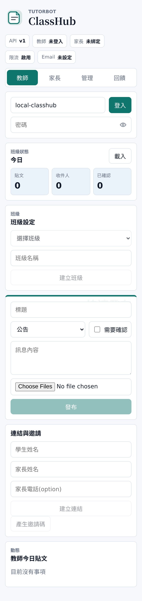
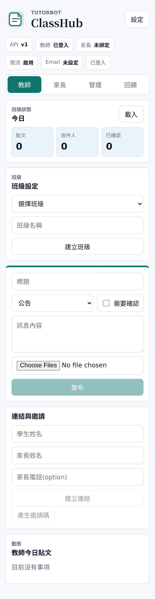
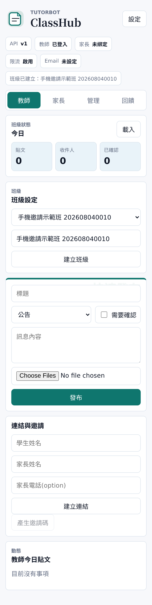
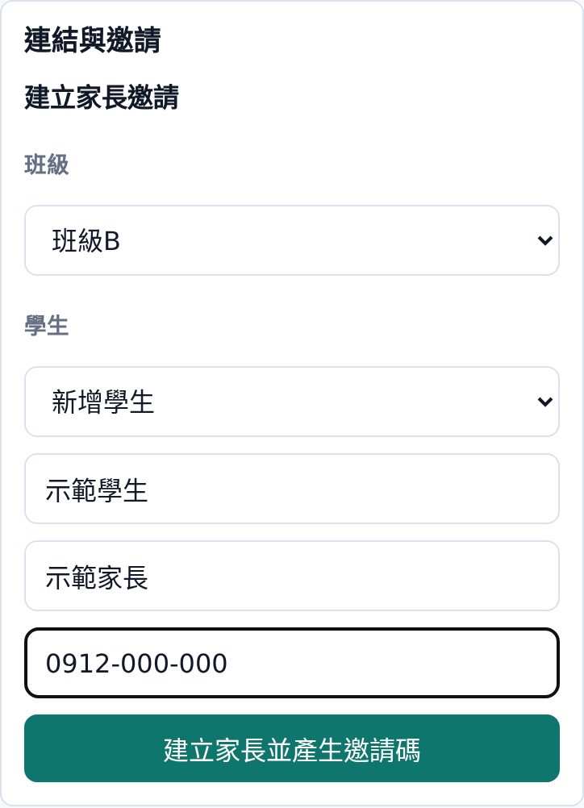
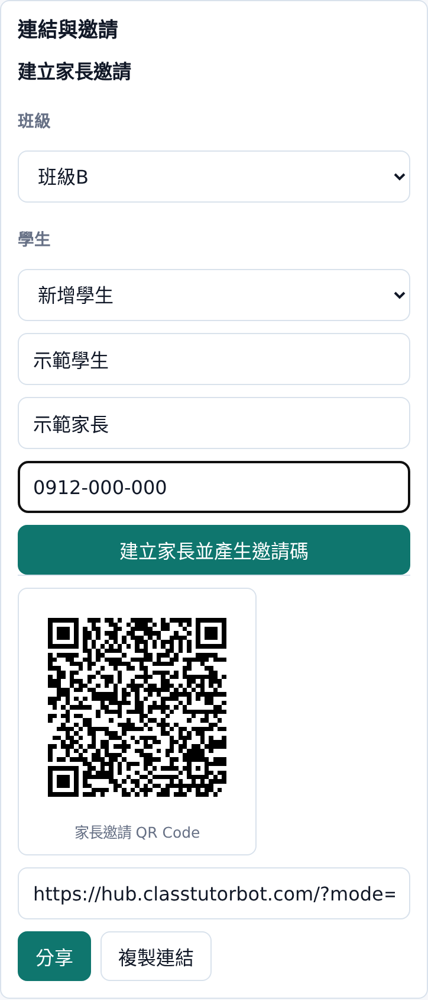
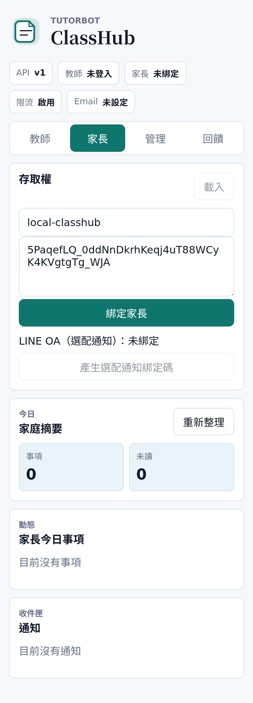
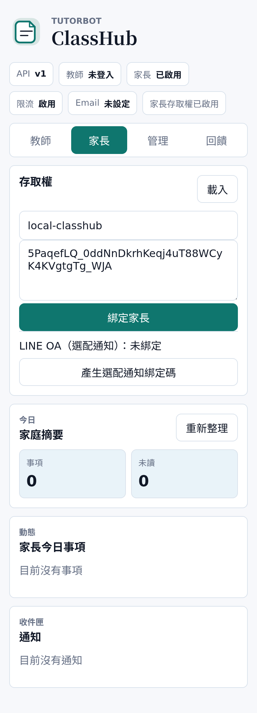

# ClassHub 家長邀請手機流程 Manual

日期：2026-08-04

本 manual 說明教師或教練在手機上建立家長邀請，並讓家長用手機開啟邀請完成綁定的流程。ClassHub 邀請支援 QR Code、手機原生分享與複製連結；教師可用 LINE、Email、Facebook 或手機上任何可分享的 App 傳給家長。

## 角色與前提

- 教師已取得 ClassHub ID 與密碼。
- 教師已登入 ClassHub。
- 教師至少已建立一個班級。
- 家長邀請必須綁定到一位學生。
- 同一位既有學生可以新增多位家長，並各自產生邀請。

## 1. 教師用手機登入

教師打開 ClassHub，輸入 ClassHub ID 與密碼後登入。



登入後，教師頁會顯示班級狀態。



## 2. 選定或建立班級

在「班級設定」區塊，教師可以選擇既有班級，或輸入班級名稱後建立新班級。發布與邀請都會以目前選定班級為操作範圍。



## 3. 建立家長邀請

在「連結與邀請」區塊的「建立家長邀請」操作：

- 先選班級。
- 學生欄位選「新增學生」時，輸入新學生姓名。
- 學生欄位選既有學生時，不需要再輸入學生姓名。
- 輸入家長姓名。
- 家長電話為選填。
- 按「建立家長並產生邀請碼」。

這個流程支援三種常見情境：

- 新學生 + 新家長：選班級，學生選「新增學生」，填學生與家長資料。
- 舊有學生 + 新家長：選班級，學生選既有學生，只填新家長資料。
- 同一學生多位家長：對同一位學生重複新增不同家長。



## 4. 產生或重產家長邀請

建立家長邀請成功後，ClassHub 會直接產生：

- 家長邀請 QR Code
- 家長邀請連結
- 分享按鈕
- 複製連結按鈕

若學生與家長已經存在於「既有連結」，教師可在「既有連結」選擇該組「學生 / 家長」，再按「重新產生邀請碼」。

教師在戶外或手機操作時，不需要貼一大串邀請碼；直接讓家長掃 QR Code，或按「分享」傳送邀請連結即可。



## 5. 分享給家長

教師可用以下任一方式給家長：

- 讓家長用手機相機掃 QR Code。
- 按「分享」，用手機系統分享面板選 LINE、Email、Facebook 或其他 App。
- 按「複製連結」，再貼到任意通訊 App。

邀請連結會帶入 ClassHub ID 與邀請碼，格式類似：

```text
https://example.com/?mode=parent&classhub_id=<ClassHub ID>&invite_token=<invite token>
```

## 6. 家長用手機開啟邀請

家長收到邀請後，點連結或掃 QR Code，手機瀏覽器會開啟 ClassHub 家長頁，並自動帶入 ClassHub ID 與邀請碼。

家長只需要按「綁定家長」。



## 7. 家長完成綁定

綁定完成後，家長即可進入家長頁查看今日事項與通知。



## 操作重點

- 「建立家長邀請」是主要入口：選班級、選新增或既有學生、填家長、產生邀請。
- 「既有連結」只用來重新產生已存在綁定的邀請碼。
- 下方「學生與家長」管理區只用來更新或刪除資料，不是邀請入口。
- 舊有學生要新增家長時，在「建立家長邀請」選既有學生，再填新家長姓名。
- 教師手機上不需要複製或貼上邀請碼。
- QR Code 適合面對面、戶外、球場或教室門口情境。
- 分享按鈕適合遠端邀請，手機會自動列出可用分享 App。
- 複製連結是分享 API 不可用時的備用方式。
- 家長端只需開連結或掃 QR Code，再按「綁定家長」。
