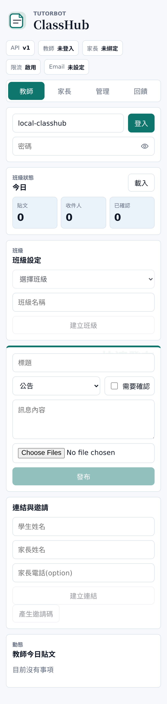
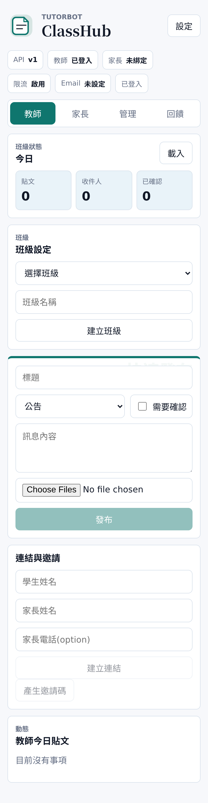
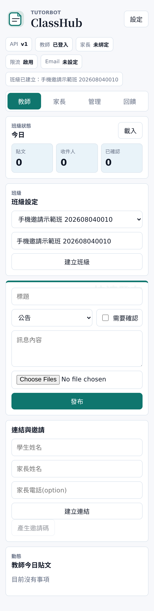
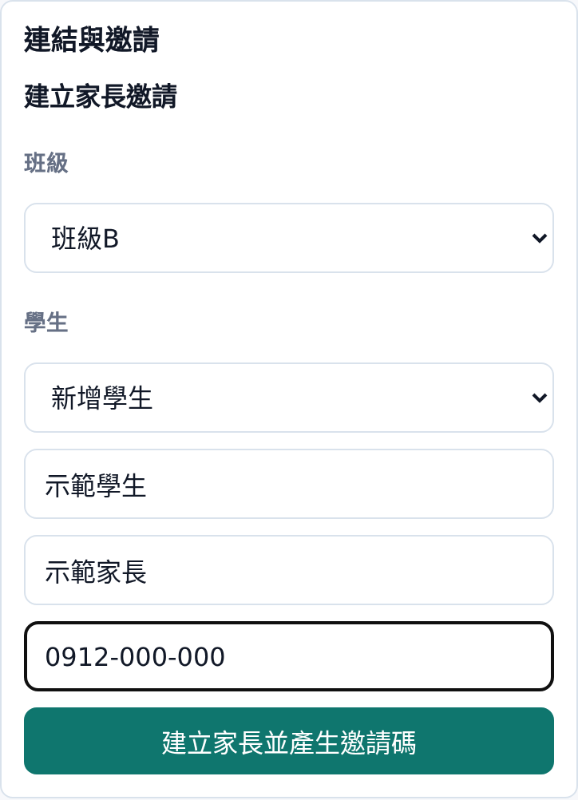
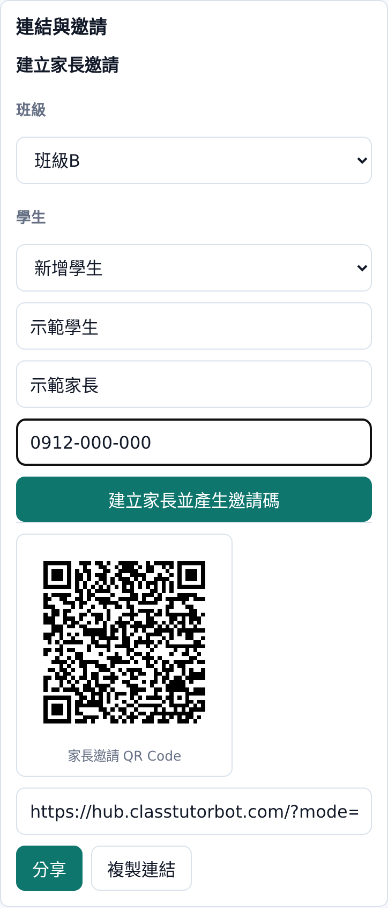
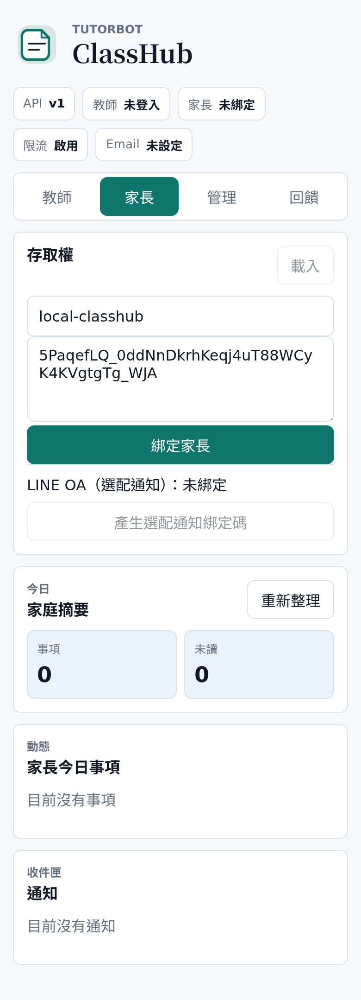
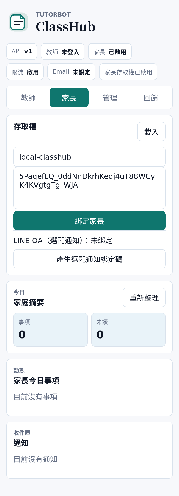

# ClassHub 聯絡人邀請手機流程 Manual

日期：2026-08-04

本 manual 說明管理者或教練在手機上建立聯絡人邀請，並讓聯絡人用手機開啟邀請完成綁定的流程。ClassHub 邀請支援 QR Code、手機原生分享與複製連結；管理者可用 LINE、Email、Facebook 或手機上任何可分享的 App 傳給聯絡人。

## 角色與前提

- 管理者已取得 ClassHub ID 與密碼。
- 管理者已登入 ClassHub。
- 管理者至少已建立一個群組。
- 聯絡人邀請必須綁定到一位成員。
- 同一位既有成員可以新增多位聯絡人，並各自產生邀請。

## 1. 管理者用手機登入

管理者打開 ClassHub，輸入 ClassHub ID 與密碼後登入。



登入後，管理者頁會顯示群組狀態。



## 2. 選定或建立群組

在「群組設定」區塊，管理者可以選擇既有群組，或輸入群組名稱後建立新群組。發布與邀請都會以目前選定群組為操作範圍。



## 3. 建立聯絡人邀請

在「連結與邀請」區塊的「建立聯絡人邀請」操作：

- 先選群組。
- 成員欄位選「新增成員」時，輸入新成員姓名。
- 成員欄位選既有成員時，不需要再輸入成員姓名。
- 輸入聯絡人姓名。
- 聯絡人電話為選填。
- 按「建立聯絡人並產生邀請碼」。

這個流程支援三種常見情境：

- 新成員 + 新聯絡人：選群組，成員選「新增成員」，填成員與聯絡人資料。
- 舊有成員 + 新聯絡人：選群組，成員選既有成員，只填新聯絡人資料。
- 同一成員多位聯絡人：對同一位成員重複新增不同聯絡人。



## 4. 產生或重產聯絡人邀請

建立聯絡人邀請成功後，ClassHub 會直接產生：

- 聯絡人邀請 QR Code
- 聯絡人邀請連結
- 分享按鈕
- 複製連結按鈕

若成員與聯絡人已經存在於「既有連結」，管理者可在「既有連結」選擇該組「成員 / 聯絡人」，再按「重新產生邀請碼」。

若群組名單已透過 CSV 匯入，或群組內已建立多位成員與聯絡人連結，管理者可按「產生整班 QR Code」。ClassHub 會產生整班聯絡人邀請卡片，每張卡片對應一位聯絡人，包含成員、聯絡人、邀請連結與 QR Code。管理者可以逐張查看，也可以列印 QR Code 卡片。

管理者在戶外或手機操作時，不需要貼一大串邀請碼；直接讓聯絡人掃 QR Code，或按「分享」傳送邀請連結即可。



## 5. 分享給聯絡人

管理者可用以下任一方式給聯絡人：

- 讓聯絡人用手機相機掃 QR Code。
- 按「分享」，用手機系統分享面板選 LINE、Email、Facebook 或其他 App。
- 按「複製連結」，再貼到任意通訊 App。

邀請連結會帶入 ClassHub ID 與邀請碼，格式類似：

```text
https://example.com/?mode=parent&classhub_id=<ClassHub ID>&invite_token=<invite token>
```

## 6. 聯絡人用手機開啟邀請

聯絡人收到邀請後，點連結或掃 QR Code，手機瀏覽器會開啟 ClassHub 聯絡人頁，並自動帶入 ClassHub ID 與邀請碼。

聯絡人只需要按「綁定聯絡人」。



## 7. 聯絡人完成綁定

綁定完成後，聯絡人即可進入聯絡人頁查看今日事項與通知。



## 操作重點

- 「建立聯絡人邀請」是主要入口：選群組、選新增或既有成員、填聯絡人、產生邀請。
- 「既有連結」只用來重新產生已存在綁定的邀請碼。
- 下方「成員與聯絡人」管理區只用來更新或刪除資料，不是邀請入口。
- 舊有成員要新增聯絡人時，在「建立聯絡人邀請」選既有成員，再填新聯絡人姓名。
- 整班名單匯入後，可使用「產生整班 QR Code」批次產生聯絡人邀請卡片。
- 管理者手機上不需要複製或貼上邀請碼。
- QR Code 適合面對面、戶外、球場或教室門口情境。
- 分享按鈕適合遠端邀請，手機會自動列出可用分享 App。
- 複製連結是分享 API 不可用時的備用方式。
- 聯絡人端只需開連結或掃 QR Code，再按「綁定聯絡人」。
